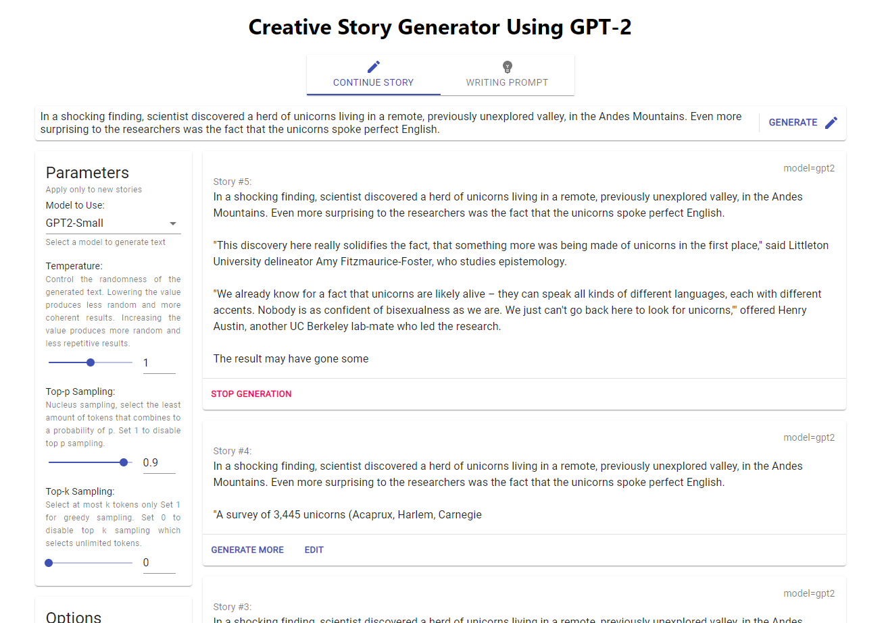

# storygen-app
This project was created to showcase different gpt2 fine-tuned models dynamically. It was used in a university project in 2021. 
The application supports continuous text generation of any length from a gpt-2 model with controls for starting, pausing and editing 
the generated text mid-way during text generation, allowing the results to react according to the user's additional input.

## Running the application

1. Make sure Python version 3.8 or above is installed
    - Older version might work but not guaranteed
2. Run run_local.bat
3. Wait for the packages to download
4. A webpage will popup, wait for the server to startup
    - If the webpage does not pop up, visit http://127.0.0.1:5000
    - Make sure the port 5000 is not occupied by other applications

## Adding custom fine-tuned models

The fine-tuned models origianllly used in the project are not made available in this repository. 
Hence, the application is only configured to use the origianl gpt-2-small model from the transformers 
library. Follow the steps below to add custom models to the application:

1. Place the folder containing the fine-tuned model to the project's root
2. Edit `static/config.js` and add a new entry referecning the added model
    - The new entries should normally be added under `continuationModels`
    - The key refers to the name displayed on the UI, the value refers to the actual folder name
      containing a single model. Any pretrained model names [available directly from the transformers library](https://huggingface.co/transformers/pretrained_models.html)
      are also valid values.
    - Models under `promptModels` are available in writing prompt mode, where a prefix of `<|endoftext|>[WP] <user input> [RESPONSE] ` is appended before sampling
      tokens from the models, where `<user input>` is the actual user input. The models specified in this mode should be fine-tuned from a dataset of such format.
3. Restart the application and clear web cache in the browser if necessary.

## Additional information and limitations

The project containes a inference backend which also serves a bulid of the respective frontend webapp interface to form a complete application.  
The text generation built using the Huggingface Transformers library. The code of the frontend webapp can be found in the `storygen-client` repository.  

The backend is built with Python `flask` and `flask-socketio` allowing streamming of the generated text to the web client continuously and indefinitely. 
While the application can technically be hosted as a web service by running `server.py` and using a reverse proxy such as NGINX, it is very 
likely to require additional work for it to become scalable and useable by multiple users simultaneously.

## Images

